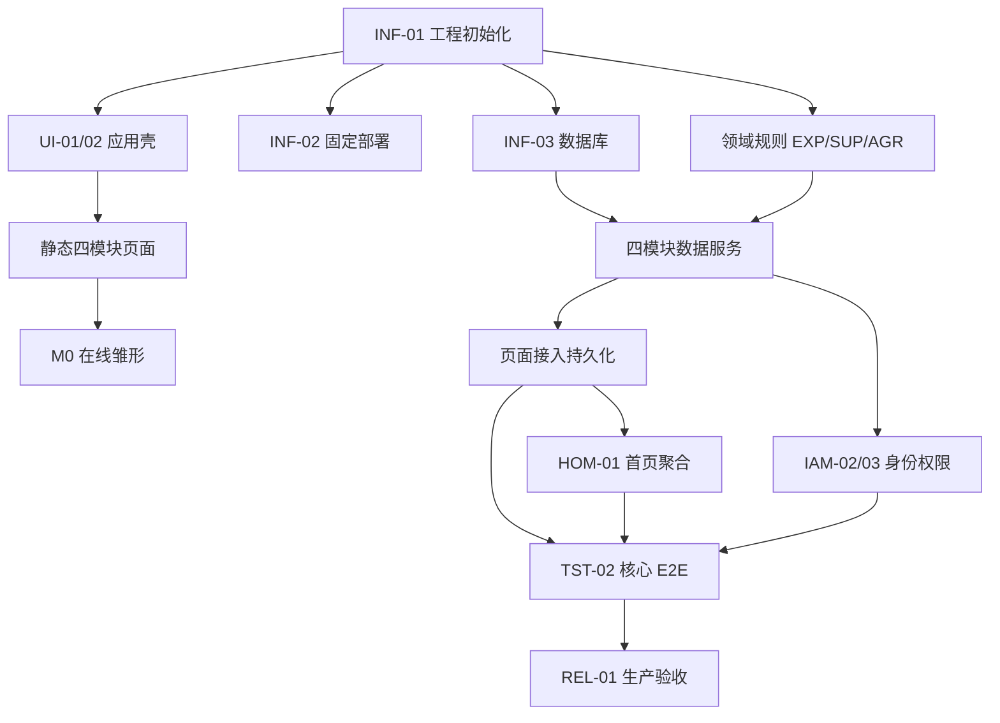

# 合租生活管家：任务拆解与实施计划

## 1. 执行原则

- 先锁定固定生产域名，再完善功能，避免违反提交链接不可变的要求。
- 先完成可点击、可理解、可恢复的演示闭环，再接真实持久化和复杂能力。
- P0 任务必须直接支撑四个核心模块或公开部署；P1 提升可信度和完成度；P2 仅在时间允许时进入。
- 每项任务都以可验证的交付物结束，避免用“完成页面”等模糊描述作为完成标准。

## 2. 里程碑

| 里程碑 | 时间盒 | 目标 | 退出条件 |
| --- | --- | --- | --- |
| M0：在线雏形 | 0～30 分钟 | 固定链接可访问，产品结构完整 | 无痕窗口可打开；四模块可进入；移动端无阻塞问题 |
| M1：核心 MVP | 30 分钟～12 小时 | 四条业务链路持久化且可操作 | 新增/更新后刷新不丢失；核心 E2E 通过 |
| M2：协作可信 | 12～30 小时 | 轻身份、权限、轮班、异常态完善 | 多成员视角一致；越权和重复数据受保护 |
| M3：交付打磨 | 30～48 小时 | 视觉、性能、测试和发布达到评审状态 | 发布清单全部通过；固定域名最终复测 |

## 3. 30 分钟雏形冲刺

该阶段默认并行使用静态演示数据和 `localStorage`，不让数据库配置阻塞公开链接。

| 时间 | 任务 | 产出/验收 |
| --- | --- | --- |
| 0～3 分钟 | 初始化 Next.js + TypeScript + Tailwind，创建 Vercel 项目 | 本地首页可运行；获得固定生产域名 |
| 3～7 分钟 | 建立全局布局、移动端底部导航、主题色和演示数据模型 | 首页与四个模块路由可互相访问 |
| 7～13 分钟 | 实现首页工作台 | 展示待付款、今日/本周值日、低库存和快捷入口 |
| 13～18 分钟 | 实现费用列表和新增费用演示 | 可新增平均分摊账单并即时展示份额 |
| 18～22 分钟 | 实现清洁排班周视图 | 可切换任务完成状态，首页待办同步 |
| 22～25 分钟 | 实现公共物品列表 | 可消耗/补货，达到阈值显示提醒 |
| 25～27 分钟 | 实现公约列表与确认 | 可确认条款并更新确认进度 |
| 27～30 分钟 | 部署并执行无痕窗口冒烟检查 | 固定链接公开；移动端首屏和四入口正常 |

若时间落后，按以下顺序降级：动画 → 桌面精细布局 → 次要筛选 → 编辑能力。不得牺牲公开部署、导航可达性和四模块的核心演示动作。

## 4. 工作分解结构（WBS）

任务状态建议使用：`TODO`、`DOING`、`BLOCKED`、`DONE`。以下工时为单人使用 AI Coding 工具的净开发估算。

### 4.1 基础工程与部署

#### INF-01 初始化工程（P0，20 分钟）

- 依赖：无。
- 工作：初始化框架、TypeScript、样式方案、路径别名、基础脚本和 `.env.example`。
- 交付物：可运行的应用骨架及 `dev`、`lint`、`typecheck`、`test`、`build` 命令。
- 验收：全新环境按 README 步骤可启动；lint 和类型检查通过。

#### INF-02 建立固定部署（P0，10 分钟）

- 依赖：INF-01。
- 工作：创建唯一生产项目、绑定 Git 仓库、配置生产分支和公开访问。
- 交付物：固定 HTTPS 生产链接。
- 验收：无痕窗口无需登录即可打开；提交链接指向生产而非 Preview 环境。

#### INF-03 数据库与迁移（P0，60 分钟）

- 依赖：INF-01。
- 工作：创建 Supabase 项目、定义 Drizzle schema、生成首个迁移、配置开发与生产连接。
- 交付物：核心数据表、索引、约束和可重复执行的迁移。
- 验收：空库可一次迁移成功；应用能完成健康检查；服务端密钥不进入客户端包。

#### INF-04 演示数据与重置（P0，40 分钟）

- 依赖：INF-03。
- 工作：准备 4 名室友、费用、值日、物品、公约和动态种子数据；实现幂等重置。
- 交付物：内容完整的“快乐合租屋”演示空间。
- 验收：重复执行不会产生重复数据；重置后四模块均有可演示内容。

#### INF-05 CI 与发布保护（P1，40 分钟）

- 依赖：INF-01、TST-01。
- 工作：配置 lint、类型检查、单元测试、构建流水线和生产部署检查。
- 交付物：自动化质量门禁。
- 验收：失败检查会阻止合并/发布；通过时生成可访问 Preview。

### 4.2 设计系统与导航

#### UI-01 视觉令牌与基础组件（P0，40 分钟）

- 依赖：INF-01。
- 工作：定义颜色、字体、间距、圆角、状态样式；封装按钮、卡片、徽标、头像、空状态和反馈组件。
- 验收：四模块复用同一套状态语义；触控区域和文本对比度达标。

#### UI-02 响应式应用壳（P0，30 分钟）

- 依赖：UI-01。
- 工作：实现顶部房屋切换区、移动端底部导航、桌面端侧边导航和内容容器。
- 验收：375px 到 1440px 无横向滚动；当前导航状态明确。

#### UI-03 全局反馈与异常页面（P1，30 分钟）

- 依赖：UI-01。
- 工作：实现 Toast、确认框、加载骨架、错误边界、404 和重试入口。
- 验收：写操作有成功/失败反馈；网络错误不会出现白屏。

### 4.3 首页工作台

#### HOM-01 聚合查询（P0，40 分钟）

- 依赖：INF-03、EXP-02、CHR-02、SUP-02、AGR-02。
- 工作：聚合当前成员待付款、到期值日、低库存和最新动态。
- 验收：只返回当前房屋数据；空数据有明确结构，不因单模块为空而报错。

#### HOM-02 首页卡片与快捷操作（P0，50 分钟）

- 依赖：UI-02；原型阶段可使用 mock 数据先行。
- 工作：实现问候区、数字摘要、待办卡片、提醒卡片、最新动态和快捷入口。
- 验收：首页一屏能识别三类重点信息；操作后对应摘要同步更新。

### 4.4 费用 AA

#### EXP-01 分摊与净额领域函数（P0，45 分钟）

- 依赖：INF-01。
- 工作：实现整数分平均拆分、尾差处理、成员余额和建议转账算法。
- 验收：0.01 元边界、100 元/3 人、多付款人数据集测试通过；份额总和永远守恒。

#### EXP-02 费用数据服务（P0，60 分钟）

- 依赖：INF-03、EXP-01。
- 工作：实现费用新增、列表、详情和事务化份额写入。
- 验收：非法成员、零/负金额、份额不守恒被拒绝；失败事务无残留数据。

#### EXP-03 费用列表与详情（P0，50 分钟）

- 依赖：UI-02、EXP-02。
- 工作：实现账务摘要、分类/成员筛选、账单列表、份额详情和空状态。
- 验收：金额格式一致；付款人与参与者清晰；移动端信息不截断关键数值。

#### EXP-04 新增费用表单（P0，60 分钟）

- 依赖：EXP-01、EXP-02、UI-01。
- 工作：实现付款人、参与人、金额、分类、日期、备注和实时分摊预览。
- 验收：错误就地提示；提交防重复；成功后返回列表并出现新账单。

#### EXP-05 结算建议与确认（P1，60 分钟）

- 依赖：EXP-01、EXP-02。
- 工作：生成净额转账建议、确认线下结算、展示历史记录。
- 验收：确认后双方余额更新；重复确认被阻止；仅相关债权人或管理员可操作。

### 4.5 清洁值日

#### CHR-01 轮班算法（P1，45 分钟）

- 依赖：INF-01。
- 工作：实现基于周序号的稳定轮换、暂停成员处理和单次换班覆盖。
- 验收：跨年周、成员数量变化、区域独立轮换测试通过。

#### CHR-02 值日数据服务（P0，50 分钟）

- 依赖：INF-03。
- 工作：实现周任务查询、惰性生成、完成/撤销和权限校验。
- 验收：同区域同日期不会重复生成；非负责人不能完成他人任务（管理员除外）。

#### CHR-03 排班周视图（P0，60 分钟）

- 依赖：UI-02、CHR-02。
- 工作：实现日期切换、区域卡片、负责人、状态、完成操作和完成率。
- 验收：本周默认可见；当天任务突出；完成状态刷新后保留。

#### CHR-04 排班配置（P1，50 分钟）

- 依赖：CHR-01、CHR-02。
- 工作：配置区域、频率、参与成员和轮换起点。
- 验收：管理员配置后能正确生成下一周期任务；普通成员只读。

### 4.6 公共物品

#### SUP-01 库存领域规则（P0，25 分钟）

- 依赖：INF-01。
- 工作：实现库存状态、增减限制和采购状态机。
- 验收：临界值、零库存、补货和非法负数测试通过。

#### SUP-02 物品数据服务（P0，50 分钟）

- 依赖：INF-03、SUP-01。
- 工作：实现新增、查询、消耗、补货、盘点和库存事件记录。
- 验收：每次变更都有操作者和事件；并发更新使用原子语句或版本检查。

#### SUP-03 库存与采购界面（P0，60 分钟）

- 依赖：UI-02、SUP-02。
- 工作：实现库存分组、数量步进、低库存提醒、加入采购清单和补货表单。
- 验收：达到阈值立即改变状态；补货后从采购清单移除；支持撤销误操作。

### 4.7 室友公约

#### AGR-01 公约版本规则（P0，25 分钟）

- 依赖：INF-01。
- 工作：定义条款修改、版本递增和确认失效规则。
- 验收：内容不变不增版本；内容改变后旧确认不计入当前进度。

#### AGR-02 公约数据服务（P0，50 分钟）

- 依赖：INF-03、AGR-01。
- 工作：实现列表、新增、编辑、确认及权限校验。
- 验收：只有管理员可修改；成员只能确认当前版本；操作写入活动日志。

#### AGR-03 公约列表与确认界面（P0，50 分钟）

- 依赖：UI-02、AGR-02。
- 工作：实现主题分组、条款详情、更新时间、确认按钮和进度。
- 验收：当前成员状态明确；确认后进度即时变化；内容支持正常换行。

#### AGR-04 公约编辑体验（P1，35 分钟）

- 依赖：AGR-02、UI-03。
- 工作：实现管理员新增/编辑表单和版本变更确认提示。
- 验收：编辑前明确提示需重新确认；取消操作不产生版本。

### 4.8 身份、成员与权限

#### IAM-01 演示身份切换（P0，25 分钟）

- 依赖：INF-04、UI-02。
- 工作：允许在预设室友之间切换当前视角，将选择保存在本地。
- 验收：切换后首页、权限按钮和“我的”数据正确变化。

#### IAM-02 创建/加入房屋（P1，75 分钟）

- 依赖：INF-03。
- 工作：创建房屋、生成邀请码、昵称加入、签名 Cookie 会话和退出。
- 验收：邀请码错误有明确提示；会话不可被客户端篡改；刷新保持身份。

#### IAM-03 租户隔离与角色权限（P1，60 分钟）

- 依赖：IAM-02。
- 工作：在服务层统一限定 `home_id`，实现 admin/member 权限并补充安全测试。
- 验收：构造其他房屋 ID 不能读取或修改数据；管理员专属操作在前后端均受限。

### 4.9 活动、通知与增强能力

#### ACT-01 操作动态（P1，45 分钟）

- 依赖：四个模块的数据服务。
- 工作：在关键写操作中追加结构化活动日志，首页展示最近动态。
- 验收：账单、值日、库存、公约各至少产生一种可读动态。

#### NOT-01 应用内提醒（P1，40 分钟）

- 依赖：HOM-01。
- 工作：生成逾期值日、待付款、低库存和待确认公约提醒。
- 验收：提醒可跳转到对应详情；已处理项不再出现。

#### NOT-02 外部通知适配器（P2，90 分钟）

- 依赖：NOT-01。
- 工作：定义通知接口，接入一种邮件或机器人通道，配置定时触发。
- 验收：开发环境可使用空实现；失败会重试且不阻塞核心事务。

### 4.10 测试、质量与交付

#### TST-01 领域单元测试（P0，60 分钟）

- 依赖：EXP-01、SUP-01、AGR-01；CHR-01 完成后补入。
- 工作：覆盖正常、边界和非法输入。
- 验收：核心领域函数分支覆盖率不低于 90%，测试可重复执行。

#### TST-02 核心 E2E（P0，75 分钟）

- 依赖：四模块 P0 页面、INF-04。
- 工作：编写费用、值日、库存、公约四条 Playwright 冒烟流程。
- 验收：在本地和 Preview 环境稳定通过；失败输出截图/trace。

#### TST-03 响应式与可访问性检查（P1，45 分钟）

- 依赖：所有 P0 页面。
- 工作：检查 375px、768px、1440px，键盘操作、焦点、标签和对比度。
- 验收：无关键级可访问性问题；无横向溢出和遮挡操作。

#### REL-01 生产发布验收（P0，30 分钟）

- 依赖：INF-02、TST-02。
- 工作：执行构建、迁移、种子、无痕访问和四流程生产冒烟。
- 验收：固定域名全流程通过；日志无未处理异常；提交链接不使用临时 Preview URL。

#### REL-02 文档与演示脚本（P1，40 分钟）

- 依赖：REL-01。
- 工作：补充运行/部署说明、架构说明、已知限制和 3 分钟演示脚本。
- 验收：新开发者可按文档启动；演示脚本覆盖四个价值点并在 3 分钟内完成。

## 5. 推荐执行顺序与依赖

可并行工作包：

- UI-01/02、INF-03、EXP-01/SUP-01/AGR-01 可并行。
- 四个业务模块的数据服务和页面可在数据模型稳定后并行。
- 测试用例设计可与页面开发并行，E2E 最终接入需等待稳定路由和种子数据。

关键路径：`INF-01 → INF-02 → UI-02 → 四模块 P0 页面 → INF-04 → TST-02 → REL-01`。

## 6. 48 小时排期建议

### 0～6 小时：可用骨架

- 完成 INF-01～04、UI-01～02。
- 先发布静态雏形并锁定域名。
- 完成领域规则和四模块数据表。

### 6～18 小时：核心闭环

- 完成 EXP-02～04、CHR-02～03、SUP-02～03、AGR-02～03。
- 完成首页聚合与真实数据接入。
- 写入最关键的单元测试。

### 18～30 小时：多人协作可信度

- 完成 IAM-02～03、EXP-05、CHR-01/04、ACT-01、NOT-01。
- 补齐事务、权限、错误状态和操作反馈。

### 30～40 小时：质量与体验

- 完成 TST-02～03、UI-03。
- 修复响应式、可访问性、并发和边界问题。
- 优化首屏文案、空状态和演示数据。

### 40～48 小时：发布缓冲

- 冻结非必要功能，执行 REL-01～02。
- 使用无痕窗口和不同尺寸设备复测固定域名。
- 保留至少 2 小时处理部署、环境变量或数据库突发问题。

## 7. MVP 总体验收清单

### 产品闭环

- [ ] 用户无需说明即可从首页理解四个模块。
- [ ] 能新增一笔费用并看到准确分摊与余额变化。
- [ ] 能完成一次值日并看到任务状态与首页同步。
- [ ] 能消耗物品、触发低库存提醒并完成补货。
- [ ] 能确认当前版本公约并看到确认进度。
- [ ] 演示数据可一键恢复。

### 工程质量

- [ ] lint、类型检查、单元测试和生产构建通过。
- [ ] 核心 E2E 在生产环境通过。
- [ ] 金额使用整数分，时间使用 UTC，查询包含租户边界。
- [ ] 关键写操作有校验、权限、错误提示和审计信息。
- [ ] 375px、768px、1440px 页面无关键布局问题。
- [ ] 无密钥、个人数据或调试日志进入 Git 仓库和客户端包。

### 上线要求

- [ ] 固定生产链接为 HTTPS、公开、无需临时授权。
- [ ] 链接来自稳定生产项目而非一次性 Preview。
- [ ] 刷新、深链和 404 行为正常。
- [ ] 数据库迁移和演示种子可重复执行。
- [ ] 监控能发现页面和服务端异常。
- [ ] 已知限制、回滚方式和演示脚本已记录。

## 8. 明确延期项

除非所有 P0/P1 验收已通过，否则不进入以下事项：真实支付、OCR、原生 App、复杂聊天、多个外部通知渠道、高级统计报表和个性化主题。这些功能展示性强，但会分散对 AA、值日、库存、公约四条主链路的打磨时间。
