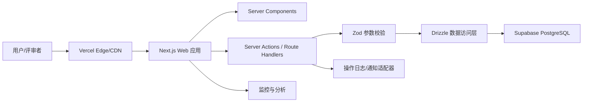

# 合租生活管家：详细技术方案

## 1. 方案目标

### 1.1 产品目标

面向 2～8 人的年轻合租群体，提供一个低学习成本、可共同维护的移动端优先 Web 应用，集中解决四类高频协作问题：

1. 费用 AA：记录账单、自动计算分摊、追踪待付款和结清状态。
2. 清洁排班：配置公共区域和轮值规则，生成值日任务并记录完成情况。
3. 公共物品：登记库存、记录消耗、在低库存时提醒补货。
4. 室友公约：共同编辑、确认和留存版本，减少口头约定产生的分歧。

产品的核心成功标准不是功能数量，而是让用户在首页回答三个问题：今天我要做什么、我欠谁多少钱、家里有什么需要补充。

### 1.2 交付目标

- **30 分钟雏形**：完成可公开访问、移动端适配的交互原型，四个模块都有可演示入口，使用演示数据，不依赖登录。
- **48 小时 MVP**：接入持久化数据和轻量身份识别，完成四条核心业务闭环，保持首次提交域名不变。
- **后续迭代**：增加通知、自动轮班、数据导出、多人实时协同和完整账户体系。

### 1.3 非目标

MVP 不处理真实支付、复杂会计规则、物业缴费平台对接、即时通信、原生 App、押金合同签署等高成本或高风险能力。费用模块只记录应收应付和线下结算结果，不托管资金。

## 2. 用户与关键场景

| 角色 | 核心诉求 | 关键操作 |
| --- | --- | --- |
| 房屋创建者/管理员 | 快速建房、邀请室友、维护基础规则 | 创建房屋、生成邀请码、设置成员与权限 |
| 普通室友 | 看清自己的待办、账务和公共事务 | 记账、确认付款、完成值日、更新库存、确认公约 |
| 访客/面试官 | 无门槛理解产品价值 | 进入演示房屋、浏览完整数据、体验关键交互 |

优先用户旅程：

1. 用户通过固定公开链接进入产品。
2. 未登录用户直接进入“快乐合租屋”演示空间，首页展示本周待办、待结算费用和低库存提醒。
3. 用户可以从首页快捷发起记账、完成值日或标记补货。
4. 正式使用时，创建者建立房屋并分享邀请码；室友用昵称加入，无需复杂注册。
5. 成员的每次操作都绑定房屋和成员，其他室友刷新后能看到一致结果。

## 3. 功能范围与优先级

### 3.1 P0：必须形成演示闭环

#### 首页工作台

- 汇总“我的待办”“我的待付款”“低库存物品”和“最新动态”。
- 提供记一笔、完成值日、登记物品三个快捷入口。
- 展示当前房屋、成员头像和本周日期范围。

#### 费用 AA

- 新增支出：标题、金额、付款人、参与人、日期、分类、备注。
- 支持平均分摊；金额以分为单位存储，最后一人的份额吸收除不尽的尾差。
- 查看账单详情及每人应付金额。
- 生成成员间净额汇总，例如“阿青应付小林 ¥42.50”。
- 债权人可将结算项标记为已结清。

#### 清洁排班

- 展示周视图值日卡片：日期、区域、负责人、状态。
- 成员可将自己的任务标记为完成或撤销完成。
- 展示连续完成次数或本周完成率，提供轻量正反馈。

#### 公共物品

- 展示物品名称、当前数量、单位、补货阈值和状态。
- 支持新增物品、增加库存、消耗一个计量单位。
- 数量小于或等于阈值时进入“待补货”列表。
- 支持标记“已加入采购清单”和“已补货”。

#### 室友公约

- 按主题展示公约条款，如作息、访客、卫生、费用。
- 管理员可新增和编辑条款。
- 成员可逐条确认，页面展示确认进度。
- 保留更新时间和修改人，避免规则来源不清。

### 3.2 P1：48 小时内提升可信度

- 昵称 + 房屋邀请码的轻量身份体系。
- 自动按周轮换值日负责人。
- 操作动态时间线。
- 表单校验、空状态、加载状态、错误反馈和乐观更新。
- 桌面端和移动端响应式布局。
- 演示数据一键重置，确保评审时始终可体验。

### 3.3 P2：后续增强

- 邮件、Web Push 或企业微信/飞书机器人提醒。
- 按比例、固定金额、排除成员等高级分摊方式。
- 收据图片上传和 OCR 识别。
- 周期账单、周期采购和周期值日自动生成。
- 日历订阅、CSV 导出、成员退出和账务交接。
- 完整登录、房屋多租户切换和实时订阅。

## 4. 信息架构与页面设计

移动端使用底部导航，桌面端切换为左侧导航。

| 路由 | 页面 | 主要内容 |
| --- | --- | --- |
| `/` | 入口页 | 自动进入演示房屋；正式模式下创建或加入房屋 |
| `/home` | 首页工作台 | 待办、账务摘要、库存预警、最新动态 |
| `/expenses` | 费用列表 | 总览、筛选、净额结算建议、账单列表 |
| `/expenses/new` | 新增费用 | 付款人、参与人、金额与分摊预览 |
| `/expenses/[id]` | 费用详情 | 分摊明细、备注、结算状态 |
| `/chores` | 清洁排班 | 本周日历、任务状态、完成率 |
| `/supplies` | 公共物品 | 库存列表、低库存、采购状态 |
| `/agreements` | 室友公约 | 分类条款、确认进度、编辑入口 |
| `/settings` | 房屋设置 | 成员、邀请码、房屋名称、演示数据重置 |

所有关键操作优先使用抽屉或模态框完成，减少移动端页面跳转；新增费用因字段较多，保留独立页面。

## 5. 技术选型

### 5.1 推荐栈

| 层级 | 选择 | 理由 |
| --- | --- | --- |
| 前端/全栈框架 | Next.js（App Router）+ TypeScript | 单仓库实现页面和服务端接口，适合快速部署及后续扩展 |
| UI | Tailwind CSS + shadcn/ui + Lucide Icons | 快速构建一致、响应式、可访问的组件 |
| 表单与校验 | React Hook Form + Zod | 前后端共享校验规则，减少非法数据 |
| 数据请求 | Server Actions 为主，Route Handlers 为辅 | MVP 减少样板代码；为外部通知保留 API 接口 |
| 数据库 | Supabase PostgreSQL | 免费额度适合演示，支持关系建模、鉴权和实时能力 |
| ORM | Drizzle ORM | 类型安全、迁移文件清晰、运行时轻量 |
| 部署 | Vercel + 固定项目域名 | 与 Next.js 集成简单，预览环境与生产环境分离 |
| 监控 | Vercel Analytics/Logs + Sentry（P1） | 覆盖访问、接口错误和前端异常 |
| 测试 | Vitest + Testing Library + Playwright | 分别覆盖业务函数、组件和核心用户旅程 |

如果 30 分钟内数据库配置受阻，雏形先使用浏览器 `localStorage` 和固定演示数据；部署域名确定后再接 Supabase，不改变页面路由和数据接口定义。

### 5.2 系统架构



采用模块化单体而不是微服务。各业务模块在代码层隔离，但共享一个部署单元和数据库，降低原型期的运维与联调成本。

建议目录：

```text
src/
  app/                    # 路由、布局、Server Actions
  components/             # 通用 UI 与业务组件
  features/
    expenses/             # 费用领域逻辑、schema、组件
    chores/               # 排班领域逻辑、schema、组件
    supplies/             # 库存领域逻辑、schema、组件
    agreements/           # 公约领域逻辑、schema、组件
  db/                     # 表定义、迁移、种子数据
  lib/                    # 鉴权、金额、日期、错误处理
  server/                 # repository、service、通知适配器
tests/
  e2e/                    # Playwright 核心旅程
```

## 6. 数据模型

所有主键使用 UUID；时间存储为 UTC，展示时按房屋时区转换；金额统一存为整数分，避免浮点误差。所有业务表均包含 `home_id`，作为租户隔离边界。

### 6.1 核心实体

| 表 | 关键字段 | 说明 |
| --- | --- | --- |
| `homes` | `id`, `name`, `invite_code`, `timezone`, `created_at` | 合租房屋/租户 |
| `members` | `id`, `home_id`, `display_name`, `avatar_color`, `role`, `status` | 房屋成员，角色为 admin/member |
| `expenses` | `id`, `home_id`, `title`, `amount_cents`, `payer_id`, `category`, `spent_at`, `note`, `created_by` | 一笔公共支出 |
| `expense_shares` | `id`, `expense_id`, `member_id`, `share_cents`, `settled_at` | 每个参与人的应承担份额 |
| `settlements` | `id`, `home_id`, `from_member_id`, `to_member_id`, `amount_cents`, `status`, `settled_at` | 净额结算记录 |
| `chore_areas` | `id`, `home_id`, `name`, `frequency`, `active` | 厨房、卫生间等清洁区域 |
| `chore_tasks` | `id`, `home_id`, `area_id`, `assignee_id`, `due_date`, `status`, `completed_at` | 具体某日的值日任务 |
| `supplies` | `id`, `home_id`, `name`, `quantity`, `unit`, `threshold`, `purchase_status`, `updated_by` | 公共物品库存 |
| `supply_events` | `id`, `supply_id`, `member_id`, `delta`, `event_type`, `created_at` | 库存变更审计记录 |
| `agreements` | `id`, `home_id`, `category`, `title`, `content`, `version`, `updated_by`, `updated_at` | 当前公约条款 |
| `agreement_acceptances` | `agreement_id`, `member_id`, `version`, `accepted_at` | 成员对特定版本的确认 |
| `activity_logs` | `id`, `home_id`, `actor_id`, `type`, `entity_type`, `entity_id`, `payload`, `created_at` | 首页动态和审计来源 |

### 6.2 关键约束与索引

- `homes.invite_code` 唯一；正式版邀请码存储哈希或支持定期轮换。
- `expense_shares(expense_id, member_id)` 唯一，且所有份额之和必须等于账单金额，由事务内业务校验保证。
- `chore_tasks(area_id, due_date)` 建立唯一约束，避免重复生成。
- `agreement_acceptances(agreement_id, member_id, version)` 唯一；公约更新后版本递增，旧确认不再计入当前进度。
- 高频查询索引：所有表的 `home_id`，以及 `chore_tasks(due_date, assignee_id)`、`supplies(home_id, purchase_status)`、`activity_logs(home_id, created_at)`。
- 删除成员采用 `status=inactive` 软删除，保留历史账单和任务引用。

## 7. 核心业务规则

### 7.1 AA 分摊与净额

平均分摊算法：

1. 将总金额转换为整数分 `total`，参与人数为 `n`。
2. 基础份额 `base = floor(total / n)`，余数 `remainder = total % n`。
3. 按稳定成员顺序，前 `remainder` 人各多承担 1 分，确保份额总和严格等于总金额。
4. 付款人也可为参与人；其应付份额与已付款金额抵消。

净额计算先求每个成员余额：`已支付总额 - 应承担总额`。正数为应收，负数为应付；再用双指针匹配债权人与债务人，生成最少且易理解的建议转账。结算记录必须在事务中更新，避免重复确认。

### 7.2 值日轮换

- 每个清洁区域独立配置频率和参与成员。
- 以区域的初始负责人下标为起点，按周序号对参与人数取模得到本周负责人。
- 成员临时换班在具体 `chore_task` 上修改，不改变后续轮转顺序。
- 定时任务不可用时，用户进入排班页后惰性生成本周任务；后续可迁移到 Vercel Cron。

### 7.3 库存状态

- `quantity > threshold`：充足。
- `0 < quantity <= threshold`：库存偏低。
- `quantity <= 0`：已用完。
- 数量不得在普通“消耗”操作后小于 0；手工盘点允许修正数量并记录事件。
- 补货完成时更新数量、清除采购状态，同时写入 `supply_events`。

### 7.4 公约版本

条款内容发生改变时 `version + 1`，已有确认记录保留但不计入当前版本。仅管理员能修改/删除条款，所有活跃成员均可确认。首页只提醒尚未确认当前版本的成员。

## 8. 服务端接口与边界

内部页面优先调用类型安全的 Server Actions。以下 REST 风格接口作为能力边界，便于测试及未来接入通知或移动端：

| 方法与路径 | 用途 | 核心校验 |
| --- | --- | --- |
| `POST /api/homes` | 创建房屋 | 名称长度、创建频率限制 |
| `POST /api/homes/join` | 通过邀请码加入 | 邀请码有效、昵称不重复 |
| `GET/POST /api/expenses` | 查询/新增费用 | 成员属于房屋、金额大于 0、份额守恒 |
| `POST /api/settlements` | 确认结算 | 债权关系有效、不可重复结算 |
| `GET /api/chores?week=...` | 查询周排班 | 日期合法、只读当前房屋 |
| `PATCH /api/chores/:id` | 完成或撤销任务 | 操作者为负责人或管理员 |
| `GET/POST /api/supplies` | 查询/新增物品 | 名称、单位和非负阈值合法 |
| `POST /api/supplies/:id/events` | 消耗、补货、盘点 | 增量和事件类型匹配 |
| `GET/POST /api/agreements` | 查询/新增公约 | 写操作仅管理员 |
| `POST /api/agreements/:id/accept` | 确认当前版本 | 版本必须与当前条款一致 |

统一返回 `{ data, error, requestId }`。业务错误使用稳定错误码，例如 `INVALID_SHARE_TOTAL`、`FORBIDDEN_HOME_ACCESS`，前端将错误码映射为中文提示，不直接展示数据库错误。

## 9. 身份、权限与安全

### 9.1 分阶段身份方案

- 雏形：固定演示房屋 + 本地选择当前演示成员；所有写操作允许重置。
- MVP：用户输入邀请码和昵称后获得签名的 HttpOnly 会话 Cookie，服务端从会话解析 `home_id` 和 `member_id`。
- 正式版：升级为 Supabase Auth 邮箱魔法链接或 OAuth；成员和房屋关系继续复用。

### 9.2 安全要求

- 服务端不信任客户端传入的 `home_id`，始终从会话取得租户范围。
- 每个 repository 查询必须带 `home_id`；若直接开放 Supabase 客户端访问，同时启用 Row Level Security。
- 写接口执行 Zod 校验、权限检查和基础频率限制。
- 邀请码使用足够随机的短码，避免连续枚举；管理员可轮换或关闭邀请码。
- 日志不记录 Cookie、邀请码、备注全文等敏感内容。
- 内容默认按纯文本展示，避免存储型 XSS；图片上传后续采用受限 MIME、大小和私有存储桶。
- 环境变量只配置在部署平台，不提交 `.env`；提供 `.env.example`。

## 10. 前端体验规范

- 以 375px 宽度优先设计，关键操作区触控尺寸不小于 44px。
- 每个列表都有骨架屏、空状态、错误状态和重试入口。
- 金额、危险删除、公约版本变更需要二次确认；普通完成/消耗操作采用乐观更新并提供撤销。
- 状态不能只依赖颜色，同时使用文字和图标；保证键盘可操作、焦点清晰、表单标签完整。
- 使用温暖、生活化的视觉风格；同一语义保持颜色一致：绿色代表完成/充足，橙色代表待处理，红色只表示错误或已用完。
- 演示首页展示“体验演示数据”提示和重置入口，避免评审误以为数据不可操作。

## 11. 测试与验收策略

### 11.1 自动化测试

- 单元测试：金额换算、平均分摊尾差、净额匹配、轮班算法、库存状态和公约版本规则。
- 组件测试：新增费用表单、值日卡、库存步进器、公约确认进度。
- E2E 冒烟：进入演示房屋 → 新增账单 → 查看净额；完成值日；消耗物品触发低库存；确认一条公约。
- 数据库测试：跨房屋数据不可见、份额事务回滚、重复任务/确认受唯一约束保护。

### 11.2 P0 验收标准

1. 公网链接在无登录、无特殊网络配置的浏览器中可打开。
2. 首屏 5 秒内可理解产品用途，四个模块均能从首页进入。
3. 在 375px、768px 和桌面宽度下无横向溢出，关键操作可点击。
4. 新增一笔 100 元三人账单后，分摊总额仍严格为 100 元。
5. 完成值日后状态与首页待办同步。
6. 公共物品降至阈值后立即出现在低库存提醒中。
7. 公约确认进度能随当前成员确认而变化。
8. 刷新页面后数据仍在；纯原型阶段至少在同一浏览器 `localStorage` 中保留。

## 12. 部署、环境与发布流程

### 12.1 环境划分

| 环境 | 分支/触发 | 数据 | 用途 |
| --- | --- | --- | --- |
| 本地 | 开发机 | 本地或开发 Supabase | 开发和测试 |
| Preview | Pull Request/非主分支 | 独立开发数据 | 验收单项功能 |
| Production | `main` | 生产 Supabase | 固定提交链接 |

建议环境变量：

```text
DATABASE_URL=
NEXT_PUBLIC_APP_URL=
SESSION_SECRET=
DEMO_HOME_ID=
SENTRY_DSN=
```

### 12.2 固定域名策略

首次部署即创建最终 Vercel 项目，并将提交链接指向生产域名（例如项目的稳定 `*.vercel.app` 地址或自定义域名）。后续通过同一项目的 `main` 分支发布，Preview URL 仅用于自测，绝不替换正式提交链接。

### 12.3 发布检查清单

- 执行 lint、类型检查、单元测试和 E2E 冒烟。
- 运行数据库迁移和幂等种子脚本。
- 使用无痕窗口检查公开访问、移动端布局和关键流程。
- 检查环境变量、日志和错误监控，不在浏览器包中暴露服务端密钥。
- 记录本次版本和回滚目标；发布失败时回滚应用版本，破坏性数据库迁移必须采用 expand/contract 策略。
- 发布后再次确认固定域名、HTTPS、首页响应和四个模块入口。

## 13. 可观测性与运营指标

### 13.1 技术指标

- 页面加载成功率、Server Action/API 错误率、P75 LCP、数据库查询耗时。
- 错误均携带 `requestId`，便于前后端日志关联。
- 关键写操作记录结构化日志，但不记录敏感内容。

### 13.2 产品指标

- 激活：首次进入后是否完成至少一个关键操作。
- 费用：每周新增账单数、结算完成率。
- 值日：到期任务完成率、逾期时长。
- 物品：低库存到补货完成的平均时长。
- 公约：当前版本成员确认率。

演示阶段只采集匿名聚合事件，并提供清晰隐私说明；不因埋点阻塞核心交互。

## 14. 风险与取舍

| 风险 | 影响 | 应对 |
| --- | --- | --- |
| 30 分钟内后端接入失败 | 无法形成在线数据闭环 | 保留 Repository 接口，先用演示数据 + localStorage，上线后无缝替换 |
| 评审者修改或清空演示数据 | 后续访问体验不完整 | 提供一键重置；生产演示数据定期自动恢复 |
| 多人同时修改产生冲突 | 状态覆盖或重复结算 | 事务、唯一约束、版本字段；P1 增加实时刷新 |
| 金额出现浮点误差 | 账目不可信 | 全链路整数分存储与守恒测试 |
| 轻量昵称身份被冒用 | 权限边界较弱 | MVP 明确为可信室友场景；正式版接入邮箱/OAuth |
| 通知能力增加部署复杂度 | 延迟主流程上线 | 先做应用内提醒，外部通知使用适配器后置接入 |
| 域名变化导致失去评审入口 | 作品无法访问 | 首次即使用最终生产项目，所有迭代只更新同一项目 |

## 15. 演进路径

1. **静态交互原型**：先证明信息架构与四个核心场景。
2. **持久化 MVP**：接数据库、轻身份、事务和演示数据重置。
3. **协作增强**：自动轮班、动态流、实时更新、通知。
4. **可信与规模化**：正式账户、RLS、审计、导出、多房屋和性能优化。

这一路径将“可展示”与“可长期演进”分开：首个版本专注产品表达，数据层和权限边界从一开始保留升级空间，避免 48 小时迭代时推倒重来。
